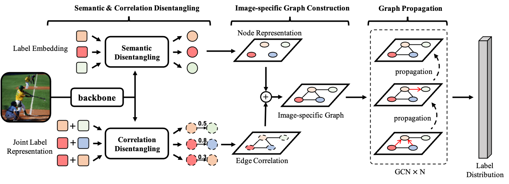

# SCDGC: Semantic and Correlation Disentangled Graph Convolutions for Multi-label Image Classification



## Environment

This project is implemented with Pytorch and has been tested on version Pytorch 1.7.0.

Try the following command for installation.
```
pip install -r requirements.txt
```
## Train

### Run on VOC07 dataset

```
sh scripts/train_voc07.sh
```

### Run on MS-COCO dataset

```
sh scripts/train_coco.sh
```

## Test

### Run on VOC2007 dataset
```
sh scripts/test_voc07.sh
```
### Run on MS-COCO dataset
```
sh scripts/test_coco.sh
```
